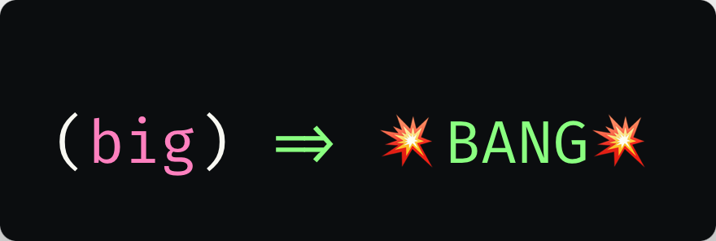

[](https://yuhrao.github.io/big-bang/)


# big-bang

My personal set of components to build apps.


### Components
| Component    | Description                                           | Clojars                                                                                         |
|--------------|-------------------------------------------------------|-------------------------------------------------------------------------------------------------|
| config       | manage configuration                                  |        |
| data-cloak   | Obscure data for security                             |    |
| database     | Handle database oprations                             |      |
| feature-flag | Manage app features with different rollout strategies |  |
| http-client  | HTTP requests                                         |   |
| logger       | Write logs to variou targets                          |        |
| serdes       | Content Negotiation                                   |        |
| webserver    | Full-featured Web Server                              |     |


<!-- Markdown-toc start - Don't edit this section. Run M-x markdown-toc-refresh-toc -->
**Table of Contents**

- [big-bang](#big-bang)
    - [Development Highlights](#development-highlights)
        - [Third-party Components to Explore](#third-party-components-to-explore)
        - [Useful Dev Tools](#useful-dev-tools)
    - [Dev](#dev)
        - [Polylith](#polylith)
        - [Scripts](#scripts)
    - [Run tests](#run-tests)
    - [To Do](#to-do)

<!-- markdown-toc end -->

## Development Highlights

### Third-party Components to Explore

- [Directus](https://github.com/directus/directus) - Headless CMS
- [Unleash](https://github.com/Unleash/unleash) - Feature flagging framework
- [Kinde Auth](https://yuhrao.kinde.com/admin) - Authorization layer for HTTP services
- [Rollbar](https://rollbar.com/) - Exception tracking (Clojure lib: [rollcage](https://github.com/circleci/rollcage))

### Useful Dev Tools

- [MailSlurper](https://www.mailslurper.com/) - Local email testing serveR

## Dev
### Polylith

Find comprehensive guides and documentation to help you start working with Polylith as quickly as possible:

- [Polylith Overview](https://polylith.gitbook.io/polylith)
- [Polylith Tool Documentation](https://github.com/polyfy/polylith)
- [RealWorld Example App](https://github.com/furkan3ayraktar/clojure-polylith-realworld-example-app)

You can also get in touch with the Polylith Team via our [forum](https://polylith.freeflarum.com) or
on [Slack](https://clojurians.slack.com/archives/C013B7MQHJQ).
### Scripts

## Run tests

```shell
# This is just a helper. Use it if you want.
alias poly='clojure -M:poly'

# unit testing
poly test project:development

# integration
poly test project:itests

# Test all
poly test :dev
```

## To Do

- [ ] Migrate JSON serde to Charred
